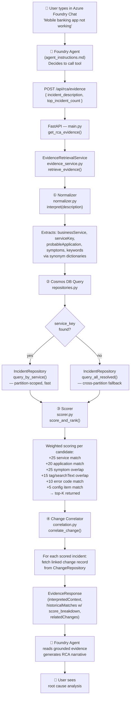

# Incident RCA Agent — Solution Overview

### What It Does
When a production incident occurs, engineers describe the problem in plain English (e.g., *"Mobile banking app is down"*). The system automatically searches historical incident records and returns the most likely root cause — grounded in real past events, not guesswork.

---

### Components

```
┌─────────────────────────────────────────────────────────────┐
│                    USER / ENGINEER                          │
│         "Mobile banking app not working"                    │
└─────────────────────┬───────────────────────────────────────┘
                      │
                      ▼
┌─────────────────────────────────────────────────────────────┐
│              AZURE AI FOUNDRY AGENT                         │
│              (Incident-RCA-Agent)                           │
│                                                             │
│  • Powered by GPT-4.1 model                                 │
│  • Follows strict RCA instructions                          │
│  • Never guesses — always calls evidence API first          │
└─────────────────────┬───────────────────────────────────────┘
                      │  Calls tool
                      ▼
┌─────────────────────────────────────────────────────────────┐
│              RCA EVIDENCE API                               │
│         (td-rca-api.azurewebsites.net)                      │
│                                                             │
│  • Hosted on Azure App Service                              │
│  • Interprets the incident description                      │
│  • Searches historical records by service, symptoms, tags   │
│  • Scores and ranks matches                                 │
└─────────────────────┬───────────────────────────────────────┘
                      │  Queries
                      ▼
┌─────────────────────────────────────────────────────────────┐
│              AZURE COSMOS DB                                │
│              (td-bank-cosmos)                               │
│                                                             │
│  • Stores historical incidents with root causes             │
│  • Stores change records linked to incidents                │
│  • Fast, scalable NoSQL database                            │
└─────────────────────────────────────────────────────────────┘
```

---

### Request & Data Flow

The sequence below traces a single request from the moment an engineer types a description through to the final RCA response.



**Key files per stage:**

| Stage | File |
|---|---|
| Tool schema (Foundry) | `src/foundry/tool_schema.json` |
| Agent instructions | `src/foundry/agent_instructions.md` |
| HTTP endpoint | `src/api/main.py` — `POST /api/rca/evidence` |
| Orchestration | `src/retrieval/evidence_service.py` — `retrieve_evidence()` |
| NL → context | `src/retrieval/normalizer.py` — synonym dicts + `interpret()` |
| Cosmos fetch | `src/cosmos/repositories.py` — `IncidentRepository`, `ChangeRepository` |
| Scoring | `src/retrieval/scorer.py` — `DeterministicScorer` (max 100 pts) |
| Change link | `src/retrieval/correlation.py` — `ChangeCorrelator` |
| Response models | `src/api/models.py` |

---

### How the Matching % Is Determined

The similarity score is a **rule-based, fully transparent algorithm** — not AI or a black box. Each incident description is broken into components and compared against every historical record across 6 dimensions:

| Dimension | Max Points | How It Works |
|-----------|-----------|--------------|
| **Business Service** | 25 | Does the description mention the same service? (e.g., "mobile app" → "mobile-banking") |
| **Application Name** | 20 | Does it reference the same specific application? |
| **Symptoms** | 25 | Do symptom keywords overlap? (e.g., "not working" expands to "unavailable, down, failed, outage") |
| **Tags / Search Text** | 15 | Do general keywords match tags in the historical record? |
| **Error Code** | 10 | Is a specific error code mentioned that matches a historical one? |
| **Configuration Item** | 5 | Does the server or component name match? |
| **Total** | **100** | Only incidents scoring **30+** are returned |

Plain English is first normalised using synonym dictionaries before scoring — so *"payments failing"* automatically maps to the `payments-platform` service with symptoms `[failed, error]`, without the engineer needing to use technical terms.

Every point awarded corresponds to a specific matching criterion, making every result fully auditable and explainable.

---

### What the Agent Returns

A structured response a human can act on immediately:

| Field | Example |
|-------|---------|
| **Root Cause** | Memory leak in customer session cache |
| **Category** | Application Defect |
| **Confidence** | 82% |
| **Matched Incidents** | INC10012, INC10015 |
| **Related Change** | CHG50014 — Load Balancer update |
| **Change Correlation** | Yes — post-implementation issues documented |

---

### Key Design Principles

- **Grounded, not hallucinated** — the AI only uses evidence from the database, never general IT knowledge
- **Fully auditable** — every answer cites the historical incident IDs and change records it was based on
- **Plain English input** — engineers don't need to fill in forms or know the system's terminology
- **Extensible** — new historical incidents and changes loaded into Cosmos DB automatically improve future results

---

### Technology Stack (simplified)

| Layer | Technology |
|-------|-----------|
| AI Model | Azure AI Foundry / GPT-4.1-mini |
| API | Python FastAPI on Azure App Service |
| Database | Azure Cosmos DB (NoSQL) |
| Source Control & CI/CD | GitHub (`td-rca-api` branch) |
