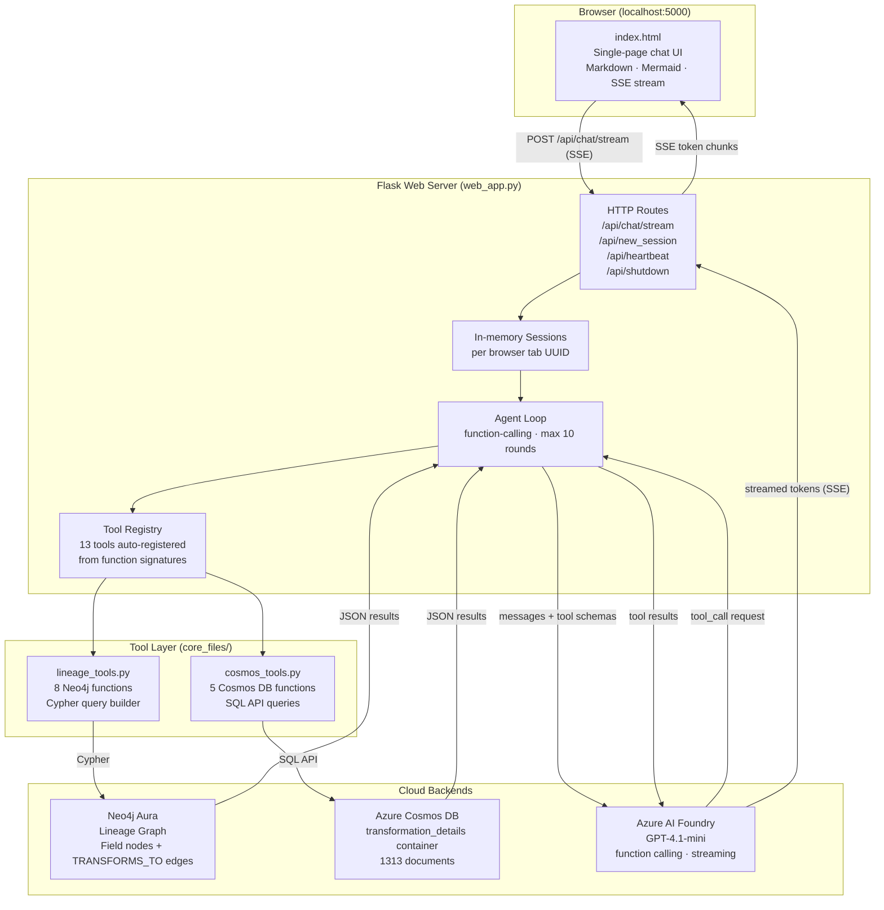
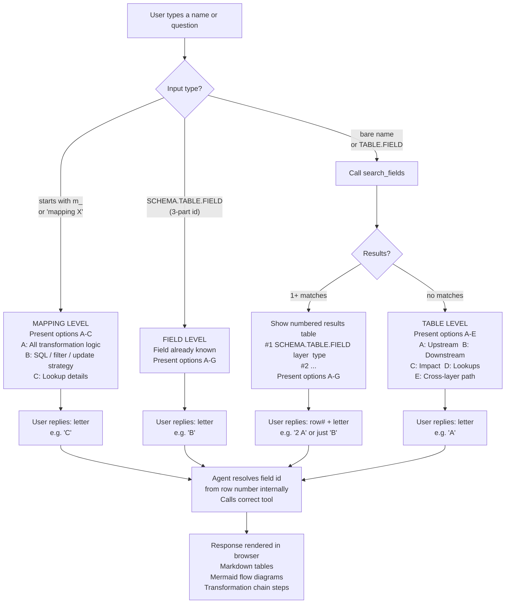

# Lineage Agent

An AI-powered chat interface for querying **cross-layer data lineage** in a banking data warehouse. Built on Azure AI Foundry (GPT-4.1-mini) with function calling, backed by a **Neo4j Aura** graph database for lineage topology and **Azure Cosmos DB** for detailed transformation logic.

---

## Purpose

The agent supports the **BLDM (Basel Lending Data Mart) decommissioning program** by letting users ask natural-language questions about how data flows through the warehouse pipeline. It translates questions into Cypher queries and Cosmos DB lookups, then returns results as Markdown tables and Mermaid flow diagrams.

---

## Data Sources

### 1. Neo4j Aura — Lineage Graph
Stores the lineage topology as a directed graph across three layers:

```
TPR (Source Systems)  →  TT (Staging/Temp)  →  DDM (Data Mart)
```

| Element | Type | Key Properties |
|---|---|---|
| `Field` | Node | `id`, `db_schema`, `table_name`, `field_name`, `layer`, `data_type`, `precision` |
| `TRANSFORMS_TO` | Relationship | `mapping_name`, `folder_name`, `transformation_name`, `transformation_type`, `expression` |

**Schemas by layer:**
- **TPR:** `SHAW_TPR`, `NCNO_STG`, `ETL_USER`, `ADDX_STG`, `USCR_RPT`, `GENERIC`, `CRDM_TMP`, `CRDM_SHD`, `RRDW_DAT`, `CORE_DAT`
- **TT:** `CRDM_TMP`
- **DDM:** `CRDM_DDM`

### 2. Azure Cosmos DB — Transformation Details
Stores one document per lineage edge with full transformation logic extracted from Informatica PowerCenter XML exports.

- **Database:** `lineage`
- **Container:** `transformation_details`
- **Partition key:** `/mapping_name`
- **Documents:** 1,313 (one per field-to-field edge)

Each document captures:

| Field | Description |
|---|---|
| `edge_id` | `SCHEMA.TABLE.FIELD__to__SCHEMA.TABLE.FIELD__m_MAPPING` |
| `from_vertex` / `to_vertex` | Source and target field ids (`SCHEMA.TABLE.FIELD`) |
| `mapping_name` | Informatica mapping name |
| `final_expression` | Expression closest to the target field |
| `custom_sql` | Source Qualifier SQL (if any) |
| `lookup_condition` | Lookup transformation condition (if any) |
| `filter_condition` | Filter / SQ filter condition (if any) |
| `update_strategy_expression` | e.g. `DD_UPDATE`, `DD_INSERT` |
| `transformation_chain[]` | Ordered steps with per-step type, name, ports, and expression |

---

## Project Structure

```
lineage-agent/
│
├── web_app.py                  # Flask web server — chat UI backend
│
├── static/
│   └── index.html              # Single-page chat UI (dark theme, Markdown + Mermaid rendering)
│
├── core_files/
│   ├── run_agent.py            # CLI version of the agent (interactive terminal chat)
│   ├── lineage_tools.py        # 8 Neo4j lineage query functions (Cypher → JSON)
│   ├── cosmos_tools.py         # 5 Cosmos DB transformation detail functions
│   ├── neo4j_client.py         # Neo4j Aura connection singleton
│   └── __init__.py
│
├── portal_setup/
│   ├── system_instructions.txt # Agent system prompt (used by Azure Foundry hosted agent)
│   └── function_schemas.json   # Tool schemas for Foundry portal configuration
│
├── requirements.txt            # Python dependencies
├── .env                        # Credentials (not committed)
└── README.md
```

---

## Entry Points

### Web App (recommended)
```bash
python web_app.py
```
Opens a Flask server (default `http://localhost:5000`). The chat UI renders agent responses as Markdown tables and Mermaid diagrams in the browser.

### CLI
```bash
python core_files/run_agent.py
```
Interactive terminal session. Same agent logic, no browser needed.

---

## Architecture Diagram



---

## UX Flow Diagram



---

## How It Works

The model receives the user's message plus all 13 tool schemas. It decides which tool(s) to call, the agent executes them, and results are fed back until the model produces a final text response — streamed to the browser via SSE.

The model **never fabricates lineage data** — every answer must be grounded in a tool's JSON response.

---

## Available Tools

### Neo4j Tools — Lineage Topology

| Tool | Purpose |
|---|---|
| `query_upstream_lineage` | Where does a table get its data from? (traces backwards) |
| `query_downstream_lineage` | What does this table feed into? (traces forward) |
| `query_column_lineage` | Full lineage chain for a specific field across all layers |
| `query_cross_layer_path` | Shortest path between two tables (e.g. TPR → DDM) |
| `query_impact_analysis` | Blast radius — all downstream tables affected if a table changes |
| `query_tables_by_layer` | List all tables in a given layer (TPR / TT / DDM) |
| `search_fields` | Find a field by name (partial match across all schemas) |
| `run_custom_cypher` | Execute a custom read-only Cypher query directly |

### Cosmos DB Tools — Transformation Logic

| Tool | Purpose |
|---|---|
| `get_field_transformation_logic` | How is a specific field derived? Returns all expressions and transformation steps |
| `get_mapping_transformation_details` | All transformation expressions and steps for every edge in a mapping |
| `get_lookup_details_for_table` | Lookup conditions and lookup table names for fields of a given table |
| `get_sql_and_filter_logic` | Custom SQL, filter conditions, and update strategies for a mapping |
| `get_edge_transformation_details` | Complete step-by-step transformation chain for a specific edge id |

Tool schemas are **auto-generated** from function signatures and docstrings at startup — no manual JSON maintenance needed.

---

## Intelligent Disambiguation

When the user types a bare name (e.g. `PARTICIPANT_KEY`) without specifying what to do, the agent:

1. **Identifies the input type** — mapping name (`m_` prefix), full field id (`SCHEMA.TABLE.FIELD`), or bare name
2. **Calls `search_fields`** for bare names and presents results as a numbered table
3. **Presents a context-aware action menu** — different options depending on whether a field, table, or mapping was identified:
   - **Field level (A–G):** column lineage, transformation expression, lookup conditions, upstream/downstream, impact analysis, SQL/filter logic
   - **Table level (A–E):** upstream, downstream, impact, lookups, cross-layer path
   - **Mapping level (A–C):** all transformation logic, SQL/filter/update strategy, lookup details
4. **User replies with a row number and letter** (e.g. `2 A`) — no retyping of field ids required

---

## Sessions

The web app maintains **in-memory chat sessions** per browser tab using a UUID session ID stored in `localStorage`. Each session keeps its own message history so the model retains context across turns. Sessions are lost on server restart.

---

## Startup Preflight Checks

On launch, `web_app.py` runs three connectivity checks before accepting requests:

| Check | What is verified |
|---|---|
| **Neo4j** | Driver connects and verifies connectivity to Neo4j Aura |
| **Cosmos DB** | Runs `SELECT TOP 1` against the `transformation_details` container |
| **Model** | Sends a `ping` to the GPT-4.1-mini endpoint on Azure AI Foundry |

If any check fails, the server prints the error and exits rather than starting in a broken state.

---

## Configuration (`.env`)

```env
FOUNDRY_PROJECT_ENDPOINT=https://<your-project>.services.ai.azure.com/api/projects/<project-name>
AZURE_AI_API_KEY=<your-api-key>
MODEL_DEPLOYMENT_NAME=gpt-4.1-mini

NEO4J_URI=neo4j+s://<your-instance>.databases.neo4j.io
NEO4J_USERNAME=neo4j
NEO4J_PASSWORD=<your-password>

COSMOS_ENDPOINT=https://<your-account>.documents.azure.com:443/
COSMOS_KEY=<your-cosmos-key>
```

---

## Dependencies

Key packages (`requirements.txt`):
- `flask` — web server
- `openai` — Azure AI Foundry / GPT-4.1-mini client
- `neo4j` — Neo4j Aura driver
- `azure-cosmos` — Azure Cosmos DB NoSQL SDK
- `python-dotenv` — environment variable loading
